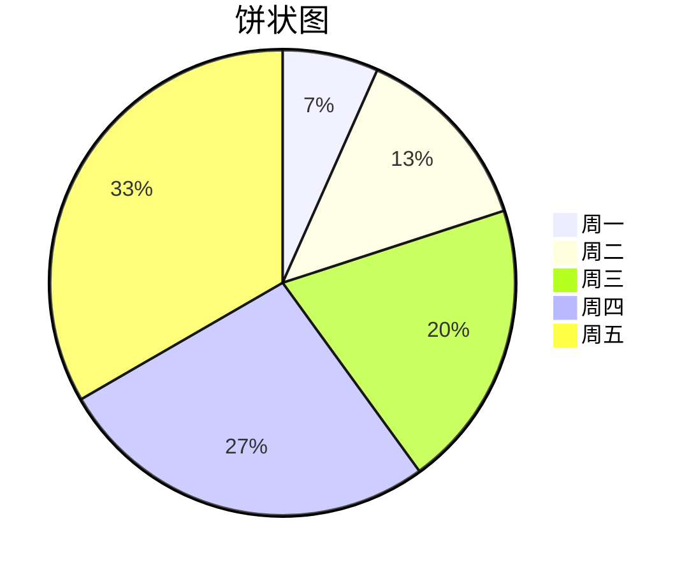

# 用 Slidev 写 PPT

<div class="abs-br m-6 flex ">
  <button @click="$slidev.nav.openInEditor()" title="Open in Editor" class="text-xl icon-btn opacity-50 !border-none hover:bg-gray-400">
    <carbon:edit />
  </button>
 </div>

---

### PPT 的功能

 <div
    v-if="$slidev.nav.currentPage === 2"
    v-motion
    :initial="{ opacity: 0, y: -1000 }"
    :enter="{ opacity: 1, y: 0,transition:{y:{delay:300}}}"
  >


</div>

---

### 什么是 Slidev, 有哪些特点?

<div v-if="$slidev.nav.currentPage === 3"
    v-motion
    :initial="{opacity:0}"
    :enter="{opacity:1,transition:{opacity:{delay:300}}}"
>

简而言之，Slidev 就是一个工具库，基于 Node.js、Vue.js ，使用 Markdown 语法 辅以 tailwindcss 等模块来制作 PPT。

</div>

<v-clicks>

- 📝 **[Markdown 基本语法支持](https://github.com/adam-p/markdown-here/wiki/Markdown-Cheatsheet#headers)**
- 🌈 **[TailwindCSS 灵活样式](https://www.tailwindcss.cn/docs/editor-support)**
- 🎨 **[可选主题](https://cn.sli.dev/themes/gallery.html)** - 当前只有官方主题可用 可访问几乎所有的开源图标集
- 🌟 **[图标](https://icon-sets.iconify.design/)** —— 能够直接从任意图标库中获取图标
- 🎥 **可交互** - 嵌入 Vue 组件
- 🤹 **🧑‍💻 开发者友好** - 内置代码高亮(无自动补全功能)
- 🎙 **演讲者模式**
- 📤 **跨平台** - 导出 PDF、PNG 和单页面应用

</v-clicks>

---

### 1. 安装和启动

Slidev 需要 Node.js 的版本 >=14.0.0

<div grid="~ cols-2 gap-2" m="-t-2">

<v-clicks>
<p>

①. npm init slidev@latest


</p>

<p>

②. npm run dev


</p>

</v-clicks>
</div>

---

### 2. 项目结构

<v-clicks>

```
your-slidev/
  ├── components/       # 自定义组件
  ├── global-bottom.vue # 页脚
  ├── global-top.vue # 页眉
  └── slides.md         # 幻灯片主入口
```

Ⅰ. components

<p class="text-xs italic">此目录中的组件可以在markdown中直接使用，其组件名与文件名相同。</p>

```
your-slidev/
  ├── ...
  └── components/
      └── counter.ts
```

<!-- ./components/Counter.vue -->
<div>
 <Counter :count="10" m="t-4" />
</div>

</v-clicks>

---

<v-clicks>

Ⅱ. 页眉页脚

<p class="text-xs italic"> 约定：根目录新增文件名为 global-top.vue | global-bottom.vue即为页眉页脚</p>

```
your-slidev/
  ├── ...
  ├── components/
  ├── global-bottom.vue
  └── global-top.vue
```

Ⅲ. slides.md，入口文件

<p class="text-xs italic"> Markdown 语法 + TailwindCss </p>

</v-clicks>

---

<div class=" p-2  animate-bounce bg-opacity-10"> 1. 常用 MarkDown 语法</div>
<div v-click class="p-5">

    1.1 分页

```
第一页
---
第二页
---
第三页
---
```

</div>
<div v-click class="p-5">

    1.2 代码块、内联样式

```ts {monaco}
interface TableSearch {
  settlementBillNo: string | number; //采购结算单号
  warehouseBillNo: string | number; //所属入库单
  merchandiseName: string; //商品名称
  supplierName: string; //供应商名称
  paymentMode: string; //是否可线上支付
}
```

<p style="color:red">内联样式</p>

</div>

---

1.3. 自定义布局

layout:two-cols(自定义布局名称)

<!-- --- -->

<template v-slot:left>

# Left

This shows on the left

</template>
<template v-slot:right>

# Right

This shows on the right

</template>

<!-- 网格布局 -->
<div class="grid grid-cols-3 gap-10">

  

  

  <div>
  	333
  </div>

  <div class="animate-spin h-5 w-5 mr-3 rounded-xl bg-gray-600">
    aa666
  </div>

<button class=" rounded-xl transition duration-500 ease-in-out bg-blue-600 hover:bg-red-600 transform hover:-translate-y-1 hover:scale-110 ">
  555
</button>

<!-- 弹性布局 -->
  <div class="flex flex-col-reverse bg-green-600  rounded-xl  cursor-move">
    <div>1</div>
    <div>2</div>
    <div>3</div>
  </div>

</div>

---

1.4. 静态资源

src: ./test.md

<!-- 不支持引用本地图片资源 -->

<!--  -->


---

1.5. [图表](https://mermaid-js.github.io/mermaid/#/)

|                                                    |     |                    |
| -------------------------------------------------- | --- | ------------------ |
| <kbd>right</kbd> / <kbd>space</kbd>                | 1   | 下一个动画或幻灯片 |
| <kbd>left</kbd> / <kbd>shift</kbd><kbd>space</kbd> | 2   | 上一个动画或幻灯片 |
| <kbd>up</kbd>                                      | 3   | 上一张幻灯片       |
| <kbd>down</kbd>                                    | 4   | 下一张幻灯片       |

<div class="-m-24">



</div>

---

### 2. 导航

将鼠标悬停在左下角以查看导航的控制面板


---

### 3. 导出

 <div >

导出为 PDF 或 PNG 的功能基于 Playwright 实现渲染。因此，使用此功能前需要安装 playwright-chromium

```ts
npm i -D playwright-chromium
```

导出 PDF

```ts
slidev export
```

导出 PNG

```ts
slidev export --format png
```

 </div>

---

### 4. [动画](https://motion.vueuse.org/).

```html
<div v-motion :initial="{ x: -80 }" :enter="{ x: 0 }">Slidev</div>
```

<div class="w-60 relative mt-6" v-if="$slidev.nav.currentPage === 13">
  <div class="relative w-40 h-40">
    
    
    
  </div>
  <div
    class="text-5xl absolute top-14 left-40 text-[#2B90B6] -z-1"
    v-motion
    :initial="{ x: -80, opacity: 0}"
    :enter="{ x: 0, opacity: 1, transition: {  duration: 1000 } }">
    Slidev
  </div>
</div>
<p class='text-sm'>Slidev 会预加载下一张幻灯片以提高性能，导致动画无法被看见，可以禁用幻灯片预加载或使用v-if来控制</p>

```html
--- preload: false ---
<div
  v-if="$slidev.nav.currentPage === 12"
  v-motion
  :initial="{ x: -80 }"
  :enter="{ x: 0 }"
>
  Slidev
</div>
```

<script setup lang="ts">
const final = {
  x: 0,
  y: 0,
  rotate: 0,
  scale: 1,
  transition: {
    type: 'spring',
    damping: 10,
    stiffness: 20,
    mass: 2
  }
}
</script>

---

### 4.部署(Netlify、Vercel、GitHub Pages)

<v-clicks>

<div class="text-xs">

4.1 [Netlify 部署](https://www.netlify.com/)


4.2 [Vercel 部署](https://vercel.com/)

</div>

</v-clicks>

<style>

.width-600{
  width:600px
}

</style>

---

4.3 通过 Github Action 部署到 GitHub Pages

        a. 创建 .github/workflows/deploy.yml 文件

<div class="text-xs italic ml-10 mt-2">Github 只要发现该目录中由 yml 文件就会自动运行该文件。</div>

```ts
name: Deploy pages
on: push
jobs:
  deploy:
    runs-on: ubuntu-latest
    steps:
      - uses: actions/checkout@v2
      - uses: actions/setup-node@v2
        with:
          node-version: '14'
      - name: Install dependencies
        run: npm install
      - name: Build
        run: npm run build
      - name: Deploy pages
        uses: crazy-max/ghaction-github-pages@v2
        with:
          build_dir: dist
        env:
          GITHUB_TOKEN: ${{ secrets.GITHUB_TOKEN }} //下一页中配置

```

---

b. 获取密钥并存储到 Github 仓库中

<div class="width-600">
  

  <div grid="~ cols-2 gap-15" m="t-2">
    
    <div class="width-600">
    
    <div v-click class="text-xs italic ml-10 mt-2">获取到token。</div>
    </div>
  </div>
</div>

<style>

.width-600{
  width:600px
}

</style>

---

c. 给项目设置 token


---

d.代码提交到 GitHub 后，进入.github/workflows/deploy.yml 点击 View runs 查看部署情况


<div grid="~ cols-2 gap-15" m="t-2">
  
  
</div>
---

### 5. 还未解决遇到的问题

      1 官方主题使用

      2 静态资源引用

      3 各幻灯片的背景、布局的设置

      4 分割slides.md

      5 演讲者模式的意义
